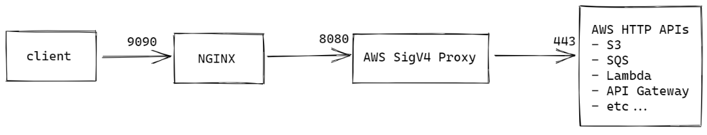

# NGINX as AWS API proxy demo

This repository contains sample code for NGINX to proxy HTTP API calls to AWS services such as S3, SQS, Lambda, API Gateway etc.

As AWS requires most requests to its HTTP APIs to be signed via the [Signature Version 4 (SigV4) signing process](https://docs.aws.amazon.com/general/latest/gr/signature-version-4.html), we will be using the [aws-sigv4-proxy](https://github.com/awslabs/aws-sigv4-proxy.git) to perform the request signing on our behalf.



## Prequisite

- [Docker Compose V2](https://docs.docker.com/compose/cli-command/)
- AWS access key ID and secret access key to sign the API request

## Setup

Create `.env` file containing the AWS credential variables
```
AWS_ACCESS_KEY_ID=<AWS access key ID>
AWS_SECRET_ACCESS_KEY=<AWS secret access key>
```

Deploy the `NGINX` and `AWS SigV4 Proxy` containers using `Docker Compose V2`
```
docker compose up -d
```

## Demo

To demonstrate this proxying capability, I created an AWS Lambda function `lseng-lambda-test-go:1` based on a sample function in the AWS documentation - [Lambda function handler using structured types](https://docs.aws.amazon.com/lambda/latest/dg/golang-handler.html#golang-handler-structs).

The `NGINX` instance is configured (see [lambda-proxy.conf](./nginx/lambda-proxy.conf)) to proxy any requests to `localhost:9090/lambda` via the `AWS SigV4 Proxy`, preserving the `Host` header (this is important as the `AWS SigV4 Proxy` uses the `Host` header value to route to the right AWS service/region).

I then triggered the Lambda function through `NGINX` using Lambda's `Invoke API`[https://docs.aws.amazon.com/lambda/latest/dg/API_Invoke.html]:

```
$ curl -H 'host: lambda.ap-southeast-2.amazonaws.com' \
    -d '{"What is your name?":"Jim","How old are you?":33}' \
    http://localhost:9090/lambda/2015-03-31/functions/lseng-lambda-test-go:1/invocations
{"Answer:":"Jim is 33 years old!"}
```

The `NGINX` configuration can be further extended so other AWS services as documented in [AWS SigV4 Proxy](https://github.com/awslabs/aws-sigv4-proxy/blob/master/README.md).
